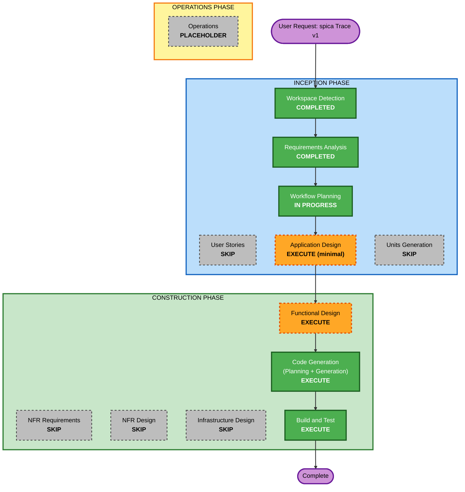

# Execution Plan — spica Trace 層 v1

## Detailed Analysis Summary

### Change Impact Assessment
- **User-facing changes**: Yes — CLI タイムライン表示・所要時間サマリー(利用者は開発者本人のみ)
- **Structural changes**: Yes — グリーンフィールドのため全構造を新規作成(パーサー / イベントストア / 表示 / CLI エントリ)
- **Data model changes**: Yes — 正規化イベントスキーマの新規定義(`.spica/events.jsonl` に永続化)
- **API changes**: No — 外部公開 API なし(CLI のみ)
- **NFR impact**: Yes — 非侵襲性(読み取り専用)、正直な表示(計測不能の明示)、最小ツールチェーン

### Risk Assessment
- **Risk Level**: Low — ローカル完結・読み取り専用・ロールバックは容易(生成物削除のみ)
- **Rollback Complexity**: Easy
- **Testing Complexity**: Simple — パーサーと時間計算のユニットテストが中心

## Workflow Visualization



### Text Alternative(テキスト版)

```
INCEPTION PHASE
- Workspace Detection ........ COMPLETED
- Reverse Engineering ........ N/A (Greenfield)
- Requirements Analysis ...... COMPLETED
- User Stories ............... SKIP
- Workflow Planning .......... IN PROGRESS (this document)
- Application Design ......... EXECUTE (minimal depth)
- Units Generation ........... SKIP (single unit: trace-cli)

CONSTRUCTION PHASE (unit: trace-cli)
- Functional Design .......... EXECUTE
- NFR Requirements ........... SKIP
- NFR Design ................. SKIP
- Infrastructure Design ...... SKIP
- Code Generation ............ EXECUTE (Planning + Generation)
- Build and Test ............. EXECUTE

OPERATIONS PHASE
- Operations ................. PLACEHOLDER
```

## Phases to Execute

### 🔵 INCEPTION PHASE
- [x] Workspace Detection (COMPLETED)
- [x] Requirements Analysis (COMPLETED)
- [x] User Stories (SKIPPED — ソロ開発・単一ペルソナ、シナリオは要件と受入基準に内包)
- [x] Workflow Planning (IN PROGRESS — 本ドキュメント)
- [ ] Application Design - EXECUTE (minimal depth)
  - **Rationale**: グリーンフィールドで全コンポーネントが新規。パーサー / イベントストア / 表示 / CLI の境界と依存方向を先に定めることで、将来の Conformance/Health 層の載せ先が明確になり、細切れ時間での作業分割もしやすくなる。最小深度で 1 ドキュメントに収める。
- [ ] Units Generation - SKIP
  - **Rationale**: 単一ユニット(trace-cli)で足りる規模。並行開発の必要なし。作業の細分化は Code Generation の計画チェックボックスで担保する。将来の Conformance/Health 層は、trace-cli を拡張する形(同一ユニット内 `src/core/` 隣への追加+サブコマンド追加)で載せる想定であり、v1 時点でのユニット分割は不要と判断する。

### 🟢 CONSTRUCTION PHASE(unit: trace-cli)
- [ ] Functional Design - EXECUTE
  - **Rationale**: 新規データモデル(正規化イベントスキーマ)と、パース・区間所要時間計算・冪等な永続化というコアロジックがあるため。承認待ち時間の「計測可能/計測不能」判定ルールもここで確定する。
- [ ] NFR Requirements - SKIP
  - **Rationale**: 技術スタックは要件で確定済み(TypeScript / Vitest / tsx / tsc)。性能・セキュリティ・スケーラビリティの新規要求なし(ローカル読み取り専用 CLI)。
- [ ] NFR Design - SKIP
  - **Rationale**: NFR Requirements をスキップするため。
- [ ] Infrastructure Design - SKIP
  - **Rationale**: ローカル実行の CLI。クラウドリソース・デプロイ基盤なし。
- [ ] Code Generation - EXECUTE (ALWAYS)
  - **Rationale**: 実装計画(チェックボックス付き)を作成・承認後にコード生成。計画のステップは 1 セッション(1〜2h)に収まる粒度に分割する。
- [ ] Build and Test - EXECUTE (ALWAYS)
  - **Rationale**: ビルド・テスト手順の文書化と検証。受入基準 5 項目の確認。

### 🟡 OPERATIONS PHASE
- [ ] Operations - PLACEHOLDER
  - **Rationale**: 将来のデプロイ・監視ワークフロー用。v1 ではローカル CLI のため対象なし。

## Estimated Timeline
- **Total Stages**: 実行 4(Application Design / Functional Design / Code Generation / Build and Test)
- **Estimated Duration**: 4〜6 作業セッション(平日夜 1h ×4〜5 + 週末 2h ×1 程度)
  - Application Design + Functional Design: 1〜2 セッション
  - Code Generation: 2〜3 セッション
  - Build and Test: 1 セッション
- **運用ルール(再開コスト対策)**: 細切れ時間(NFR-3)では前回文脈の想起コストが発生するため、Code Generation の各セッション終了時に「次回やることリスト+直前の変更点」を一言メモとして残す。実際にかかったセッション数は Build and Test 完了時にここへ追記し、次回以降の見積り精度向上に使う。

## Success Criteria
- **Primary Goal**: 本リポジトリの audit.md をパースし、CLI でタイムラインと所要時間サマリーを表示できる
- **Key Deliverables**: パーサーモジュール / イベントスキーマ + JSONL ストア / タイムライン・サマリー表示 / CLI エントリ / Vitest テスト
- **Quality Gates**: requirements.md の受入基準 5 項目、`npm test` と型チェックのパス、各ステージの承認ゲート
